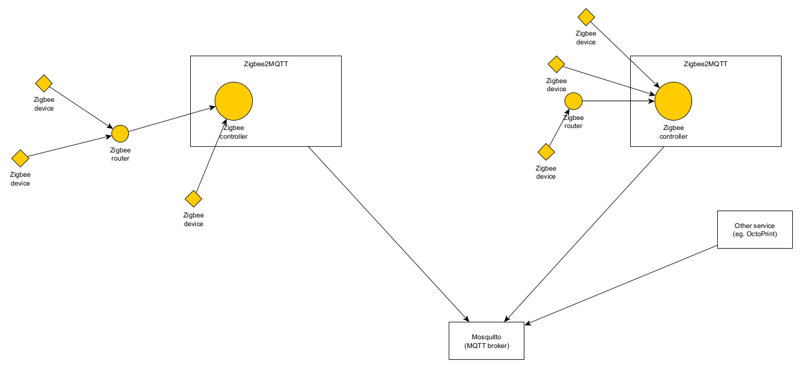

# How it works

Zigbee devices are joined to a router, where the controller is a special kind of router. The controller itself is managed by Zigbee2MQTT, which is running on the same hardware as the controller (USB).

Zigbee2MQTT connects to an MQTT broker, in this case Mosquitto. Home Assistant's MQTT integration also talks to the MQTT broker, and via publishing on the `homeassistant` topic discovers new devices.

# Zigbee2MQTT

I've set up the first Zigbee2MQTT server within the Home Assistant Raspberry Pi itself. The default configuration here works, and devices will be published under the `zigbee2mqtt` topic.

## Multiple server

Setting up a second Zigbee2MQTT server (eg. in another location) requires devices to be published under a different topic to the default (`zigbee2mqtt`). If this isn't done, `homeassistant` topics will not be published and device discovery will not work in Home Assistant (in fact, the devices will disappear).

You will need to set up credentials for this Zigbee2MQTT server to access Mosquitto (the MQTT broker). This can be done by setting up a native Home Assistant user, and using this username and password in Zigbee2MQTT.
